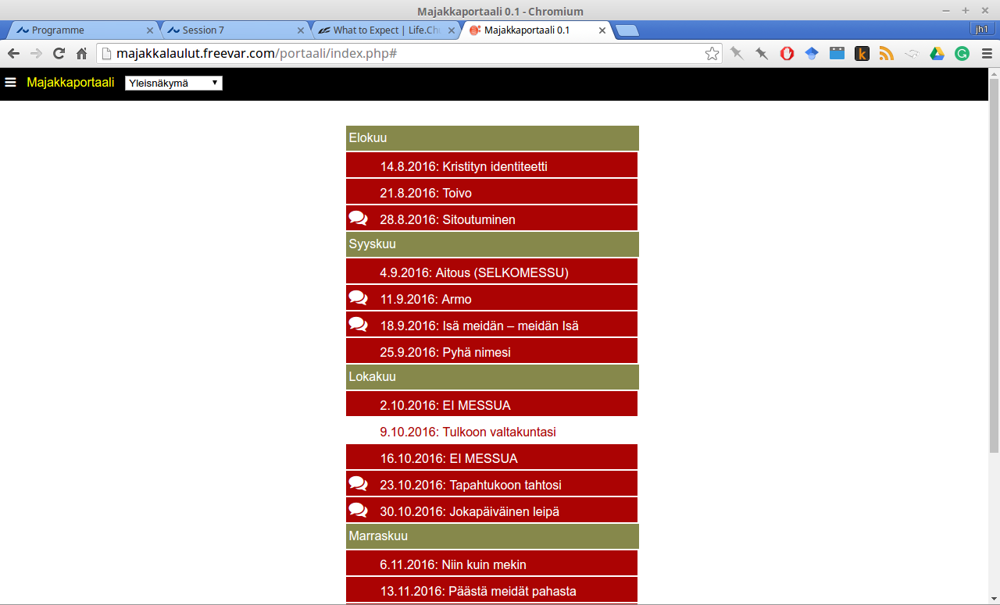
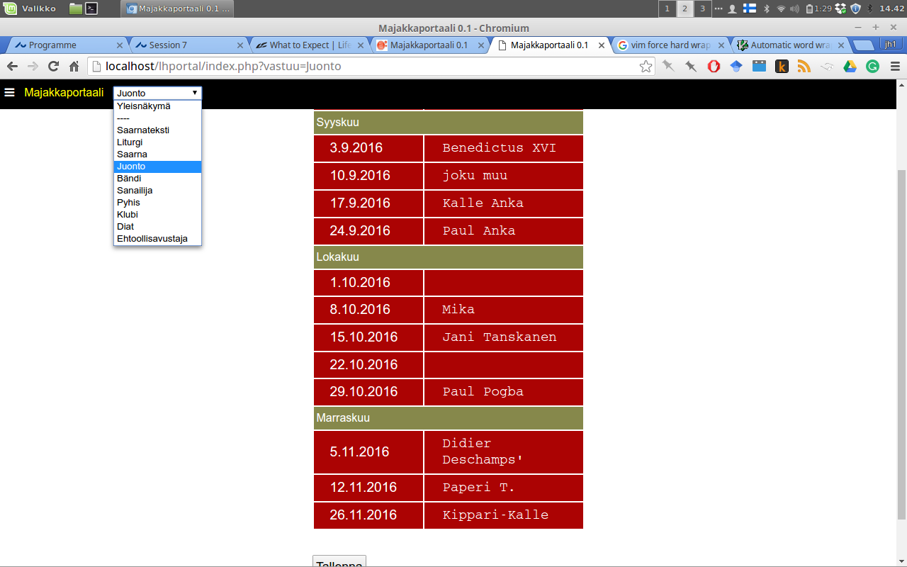
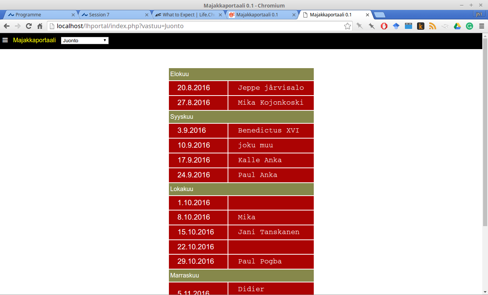
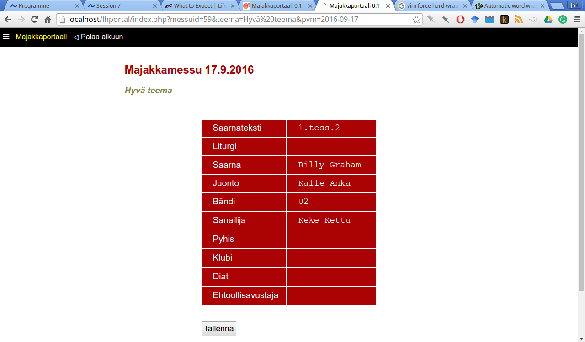
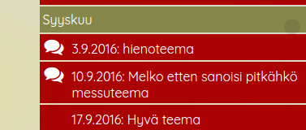

<article id="cont">

Majakkaportaalin ajatuksena on koota tietoja messuista ja tekijöistä yhteen
paikkaan ja helposti päivitettäväksi. Portaaliin on yhdistettävissä myös
mahdollisuus luoda laulun sanat sisältäviä selaimessa toimivia diaesityksiä.
Näiden käyttöohje on vasta tekeillä.

Alkuun pääseminen ja yleisiä kysymyksiä
---------------------

### Miten lisään uusia messuja?

Uusia messuja voi lisätä vasemman yläkulman valikosta kohdasta Ylläpito
(alakohta [Syötä uusia messuja](insert_messudata.php)). Voit vaihtaa käsillä
olevaa messukautta saman valikon ensimmäisestä linkistä.

### Mikä ihmeen kausi?

Kuvittele, että käytät portaalia kolme vuotta. Siinä ajassa toteutettuja
messuja kertyisi melkoinen määrä, ja olisi epämukavaa, jos kaikki näkyisivät
aina kerralla. Tämän vuoksi messut kannattaa jaotella *kausiksi*. Tyypillisiä
kausia voivat olla esimerkiksi "Syksy 2018", "Kevät 2019" tai  "Kesä 2020".
Kaudet määritellään Edellä mainitussa [*Syötä uusia messuja*
- näkymässä](insert_messudata.php): kun syötät uusia messuja, määrität samalla,
mihin kauteen ne kuuluvat. Voit valita jonkin olemassaolevan kauden tai valita
pudotusvalikosta kohdan "Lisää uusi kausi".

### Miten muutan messun teemaa

Avaa [messukohtainen näkymä](ohjeet.html#messukohtainen-näkymä). Klikkaa messun
teemaa, niin teema muuttuu tekstikentäksi, jota voit muokata. Paina lopuksi
"Tallenna teema".

Yleisnäkymä messuista
---------------------

Perusnäkymä, joka avautuu portaaliin kirjauduttua, esittää listän *yhden kauden*
messuista. Messut on jaoteltu kuukausittain hahmottamisen helpottamiseksi. Lista
näyttää messun päivämäärän ja teeman. Lisäksi päivämäärän vasemmalla puolella
saattaa näkyä puhekuplaa muistuttava ikoni (tästä enemmän [alempana](ohjeet.html#puhekuplat-alkunäkymässä)).

Jos klikkaat messun päivämäärää tai sen teemaa, siirryt [messukohtaiseen
näkymään](ohjeet.html#messukohtainen-näkymä).

Vastuukohtainen näkymä
----------------------

Melko todennäköisesti sinua kiinnostaa messujen tarkastelu pääasiassa
esimerkiksi *juontajien*  tai *rukouspalvelijoiden* osalta. Tämä tarkoittaa
siirtymistä *vastuukohtaiseen näkymään*, jossa eteesi avautuu lista päivämääristä ja 
kullekin päivämäärälle joko tyhjä viiva tai konkreettisen vastuuhenkilön nimi.
Vastuukohtaiseen näkymään siirrytään ruudun ylälaidan vetovalikosta:

Esimerkkinä seuraavassa kuvassa on lista koko (kuvitteellisen) syyskauden kaikista
(kuvitteellisista) juontajista:

**Jos haluat muuttaa tai lisätä uuden juontajan** jollekin päivämäärille, klikkaa
vain kyseistä päivämäärää tai sen kohdalla olevaa nimeä / tyhjää ruutua.
Kirjoita uusi nimi ja **paina lopuksi joko enter-näppäintä tai klikkaa listan
alla olevaa Tallenna-nappia**.

Pääset takaisin yleisnäkymään valitsemalla ylälaidan vetovalikosta "yleisnäkymä".

Messukohtainen näkymä
---------------------

Toinen majakkaportaalin käyttötapa on tutkia yhtä messua kokonaisuutena. Tämä
tapahtuu klikkaamalla [yleisnäkymässä](ohjeet.html#yleisnäkymä-messuista) sitä
riviä (päivämäärää / teemaa), joka sinua kiinnostaa. Messukohtaisessa näkymässä
on listattu kaikki messuun liittyvät vastuut ja kunkin vastuun kohdalle henkilön
nimi. Myös tässä näkymässä voit muuttaa tai lisätä henkilön nimen klikkaamalla
sitä (tai tyhjää ruutua). Jälleen kerran, muutos on vahvistettava joko
painamalla enter-näppäintä tai listan alla olevaa tallenna-nappia. 

Voit myös **muuttaa messun teemaa** klikkaamalla sitä (teeman alle ilmestyy
tässä tapauksessa 'vaihda teemaa' -painike, joka vahvistaa teeman muutoksen).

Huomiot (kommentit, infot)
-------------------------

**Toinen tärkeä** toiminto messukohtaisessa näkymässä  ovat niin kutsutut
*huomiot*. Nämä voivat olla:

1. Tapahtumailmoituksia tai muita asioita, joita messussa mielestäsi pitäisi
ilmoittaa

2. Avunhuutoja siitä, että jokin vastuunkantaja puuttuu

3. Tapa, jolla esimerkiksi saarnaaja ja juontaja vaihtavat tietoja siitä,
minkälaisia teemoja aiotaan käsitellä.

Huomiota lisättäessä voit kohdistaa ne johonkin tiettyyn vastuuseen tai jättää
aiheen määrittelemättä. Viestintää helpottanee myös, jos kirjoitat mukaan nimesi.
Kaikkia kommentteja voi myös muokata jälkeenpäin, tai niitä voi poistaa.
Huomioiden kehittyneempi, viestiketjuista koostuva versio
on rakenteilla.

### Puhekuplat alkunäkymässä

Kun johonkin messuun on lisätty huomioita messukohtaisessa näkymässä,
yleisnäkymään ilmestyy tämän messun kohdalle pieni puhekupla:

Huomioiden tarkastelemiseksi ei ole tämän jälkeen ole enää pakko
siirtyä messukohtaiseen näkymään, vaan huomioihin voi tehdä pikakurkistuksen
klikkaamalla puhekuplaa.

Lisää kysymyksiä? Yhteystiedot?
===============================

Portaalin lähdekoodi on saatavilla [Githubista](http://github.com/hrmJ/lhportal).
Kysymyksiä voi esittää  vaikka suoraan sähköpostilla, juho.harme ät gmail.com.

</article>

<!--

pandoc ohjeet.md -o ohjeet.html --toc --include-in-header=styles/ohjestyles.css

-->

